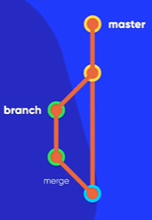

### Branches ou Ramificações 

- Master (ramificação) > Commit > Push para a Origin (Repositório Remoto)

- Evitar commitar na Master (main) proposta do video

- Ao criar uma feature nova criar uma branch nova 

- Merge é quando se faz a junção das alterações de uma branch com a main.

- é possível criar criar varias branch ao mesmo tempo

- é possível apagar a branch sem afetar a main possibilitando a main ser usada como um ponto de referência 
    além de deixar a branch original intacta, caso precise voltar atrás.

